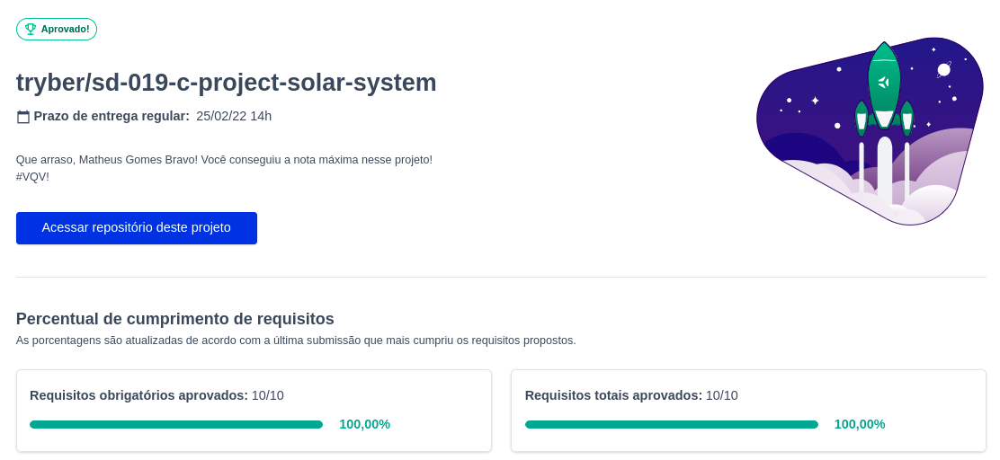

# Solar system
Projeto feito enquanto estudava na [Trybe](https://www.betrybe.com/), utilizando HTML, Sass e React no módulo de front-end, o objetivo era praticar o uso de componentes, props e as funcionalidades do Sass. Entregue com 100% dos requisitos respeitando o ESLint.

## Direitos autorais

Esse projeto foi desenvolvido por mim ([Matheus Gomes](https://www.linkedin.com/in/matheusgb/))apenas visando o aprendizado.

